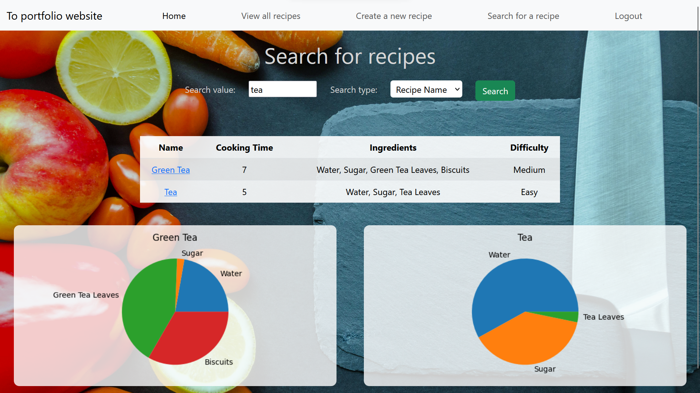

## Recipe App ##

## Intro

Built with Python Django

<a href="https://reci-please-8df178786b88.herokuapp.com" target="_new">Live site </a>

## Description
This app allows users to create and browse cooking recipes. Registered users can create recipes by providing a name, cooking time, and a list of ingredients. The app then contains functionalities to display all recipes, to search for recipes with specific ingredients, and to modify or delete an existing recipe. Graphs and charts were also included for data visualisation using Matplotlib. The app is hosted on Heroku. 

## Technologies used

- Python (3.8.7)
- Django
- Numpy
- Pandas
- Matplotlib
- Heroku

## Setting up the project

- First install the required dependencies from the requirements.text using your prefered virtual environment.
- Once this is complete you can clone the repository on your local machine and run the application locally.
- I have separated the development and production scripts in the make file as there are two settings.py files (for security purposes)
- to run the file locally run (this will require you to install Make on your virtual environment)
    make dev-start

## Hosting the App on Heroku

- Signup for a free account at https://www.heroku.com/

- Install the Heroku client from the website

- Then login by running 

$ Heroku Login

- Create your app by running

$ heroku create

- To push the changes to heroku, run

$ git push heroku main (warning: check stasticfiles/css if problems with css in deployed version)

- Finally, set up the database tables

$ heroku run python manage.py migrate